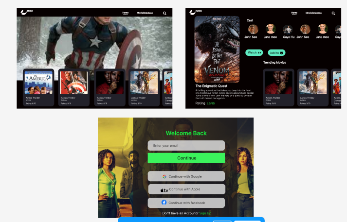

# THE MOVIE DATABASE 

# MovieDatabase App




MovieDatabase is a web application built with **React** and **Vite** that allows users to browse, search, and discover information about movies. It fetches data from a movie API (e.g., TMDB) and displays details such as movie titles, release dates, ratings, and more.

## Features

- **Browse Popular Movies**: View a list of popular movies.
- **Search Movies**: Search for movies by title.
- **Movie Details**: Click on a movie to view detailed information, including synopsis, cast, ratings, and trailers.
- **Responsive Design**: Works seamlessly on desktop, tablet, and mobile devices.
- **Lightweight and Fast**: Built with Vite for a blazing-fast development experience.

## Technologies Used

- **Frontend**: React, Vite
- **Styling**: CSS or a framework like Tailwind CSS
- **API**: [The Movie Database (TMDB) API]
- **State Management**: React Context API or Redux (optional)
- **Routing**: React Router DOM

## Installation

Follow these steps to set up the project locally:

1. **Clone the repository**:
   ```bash
   git clone https://github.com/your-username/moviedatabase-app.git
   cd moviedatabase-app